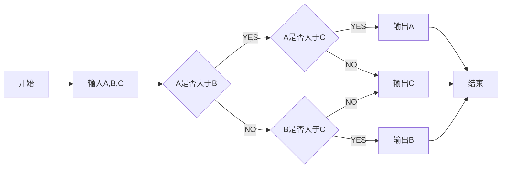

**项目说明** 
==================================

- 个人学习用,希望用此搭建基于springCloud的完整结构
- 同时搭载想实现的 [^小功能] 
- 
  

 **技术选型：** 

- 核心框架：Spring Boot 2.1
- 安全框架：Apache Shiro 1.4
- 视图框架：Spring MVC 5.0
- 持久层框架：MyBatis 3.5
- 定时器：Quartz 2.3
- 数据库连接池：Druid 1.1
- 日志管理：SLF4J 1.7、Log4j
- 页面交互：Vue2.x

 

 **软件需求** 

- JDK1.8
- MySQL5.5+
- Maven3.0+

 

